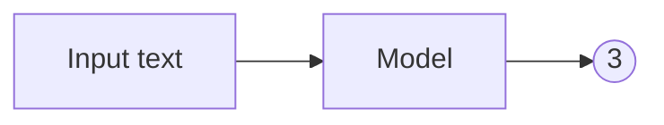
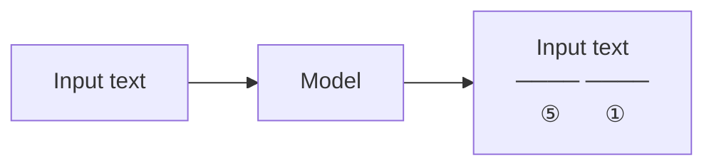
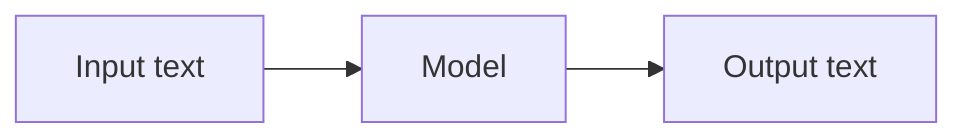
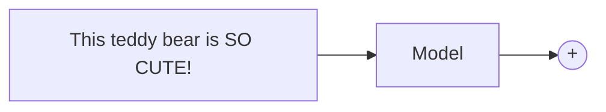
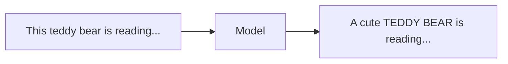
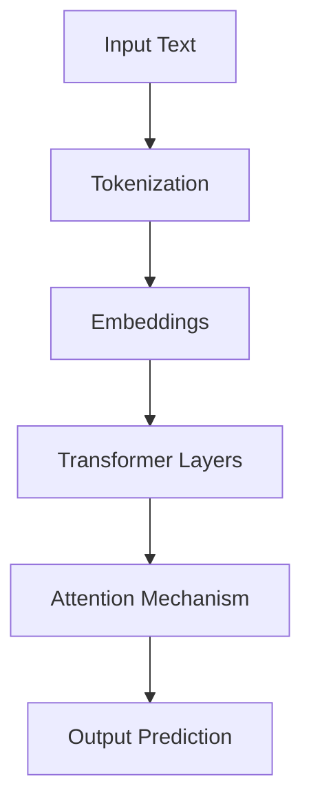

# Lecture 1 – Transformer

> Source: https://www.youtube.com/watch?v=Ub3GoFaUcds&list=PLoROMvodv4rOCXd21gf0CF4xr35yINeOy  
> Date: 2026-05-26
> Duration: 1:41:49

---

## 🎯 Lecture Goal

Understand the foundations of transformer architectures and why they became the dominant approach for modern large language models (LLMs).

---

## 🧠 Core Concepts

### NLP overview

#### Definition and Categories
Natural Language Processing: Computing things with text

##### Classifikation

We want to predict something:
(Exapmle Movie Review)
- sentiment extraction -> is something positive, negative or neutral
- intent detection -> knowing what the Person wants to do
- language detection -> knowing in what language the person writes
- Topic modelling -> knowing what the text is about

##### "Multi"-classification

- Named entity recognition (NER) -> extracting diffrent entities from the text (e.g. people, places, time)
- Part of speech tagging -> figuring out which word is a noun, verb, adjective etc.
- Dependency parsing -> figuring out how the words in a sentence relate to each other
- Constitunency parsing -> figuring out how the words in a sentence group together

##### Generation

- Machine translation -> translating text from one language to another
- Question answering -> answering based on given content
- Summarization -> summarizing a long text into a shorter one
- Text generation -> generating new text (e.g. story, code, email etc.)

#### Example NLP tasks:

##### NLP task 1: Sentiment extraction

Datasets:
- Review/critique data like IMDB critiques, Amazon reviews, Twitter etc.
Evaluation:
- Accuracy -> percentage of correct predictions
- Precision -> precentage of correct predictions that are ACTUALLY positive
- Recall -> percentage of actual positives that were correctly predicted
- F1 score -> harmony of precision and recall, so it gives a good overall picture of the model's performance

Why all these metrics?
Sometimes you have datasets, which are very unbalanced. (e.g. 95% positive reviews and only 5% negative reviews))
-> can lead to a model that always predicts the majority class, which can give you a high accuracy but a very low precision and recall for the minority class.

##### NLP task 2: Name entity recognition (NER)

"Multi"-classification -> Input text and you predict multiple labels for each token in the text
 
 Datasets:
 - Annotated news articles, Wikipedia, CoNLL-2003, CoNLL++, etc.
 Evaluation:
 - Accuracy -> percentage of correctly labeled tokens
 - Precision -> percentage of correctly labeled tokens that are ACTUALLY correct
 - Recall -> percentage of actual correct labels that were correctly predicted
 - F1 score -> harmony of precision and recall

##### NLP task 3: Machine translation
 ```mermaid
graph LR
    A[A cute teddy bear is reading] --> B[Model]
    B --> C[Un ours en peluche mignon lit]
```
Generation -> Input Text and Output Text

Datasets:
- Popular language datasets like WMT'14, IWSLT, Europarl, etc.
Evaluation:
- BLEU(Bilingual Evaluation Understudy) -> quality of the translated text (similar to precision)
- ROUGE(Recall-Oriented Understudy for Gisting Evaluation) -> quality of the generated text (similar to recall)
- Perplexity -> how well the model predicts the next word in the sequence (lower is better)


- ChatGPT
- AI copilots
- Search systems
- AI agents
- Translation systems


---

### Attention Mechanism

#### Definition
Attention allows the model to focus on the most relevant parts of the input sequence.

#### Why It Matters
- Handles long context better
- Learns relationships between words/tokens
- Enables contextual understanding

#### Real-World Usage
- Long-context chatbots
- Code generation
- RAG systems
- Multi-agent reasoning

#### Notes
-

---

### Tokens & Embeddings

#### Definition
Text is converted into tokens and then transformed into embeddings, which are numerical vector representations.

#### Why It Matters
- LLMs process numbers, not raw text
- Embeddings capture semantic meaning
- Basis for vector search and RAG systems

#### Real-World Usage
- Semantic search
- Retrieval systems
- Recommendation systems
- AI memory systems

#### Notes
-

---

## ⚙️ Engineering & System Design Insights

Important implementation or architecture ideas mentioned in the lecture.

- 
- 
- 

---

## 📌 Important Terms & Techniques

| Term | Meaning | Practical Relevance |
|---|---|---|
| Transformer | | |
| Attention | | |
| Token | | |
| Embedding | | |
| Context Window | | |
| Inference | | |

---

## 🏗️ Architecture Notes

### Transformer Flow



---

## 🔥 Key Takeaways

- 
- 
- 

---

## ❓ Open Questions

Things I still need to understand better.

- 
- 
- 

---

## 🚀 Practical AI Engineering Applications

How could this lecture connect to practical AI systems?

### Possible Connections

- AI agents
- RAG systems
- AI copilots
- Automation workflows
- Tool calling
- Local LLM systems

---

## 🧪 Experiment / Mini Project

### Goal

Create a first local AI chat application using Ollama and Python.

---

### Stack

- Python
- Ollama
- VS Code
- OpenAI SDK

---

### Steps

- Install Ollama
- Run a local model
- Connect via Python
- Send first prompt
- Print response

---

### Result / Learnings

What worked?  
What failed?  
What did I learn?

-

---

## 💻 Code Snippets

```python
from openai import OpenAI

client = OpenAI(
    base_url="http://localhost:11434/v1",
    api_key="ollama"
)

response = client.chat.completions.create(
    model="llama3",
    messages=[
        {
            "role": "user",
            "content": "Explain transformers simply"
        }
    ]
)

print(response.choices[0].message.content)
```

---

## 🖼️ Screenshots / Diagrams

### Ollama Running

```markdown

```

---

## 📚 Additional Resources

- https://ollama.com
- https://platform.openai.com/docs
- https://python.org

---

## ✅ What I Understand Well

- 
- 
- 

---

## 🔁 What I Need To Revisit

- 
- 
- 

---

## ⭐ One-Sentence Summary

Transformers use attention mechanisms to efficiently process and understand sequences, forming the foundation of modern large language models.
